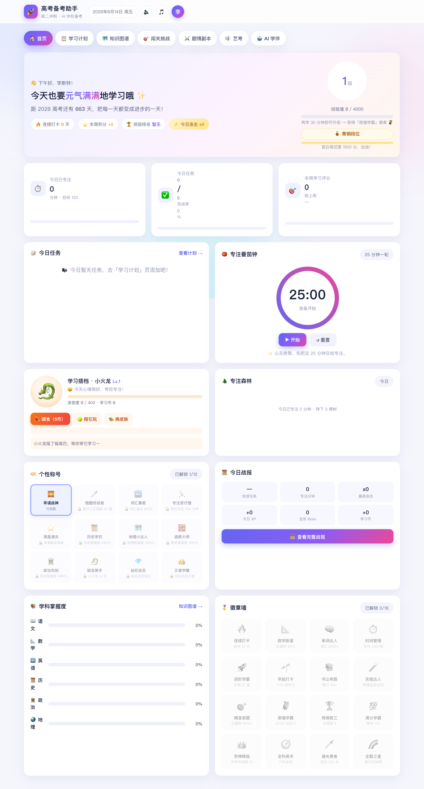
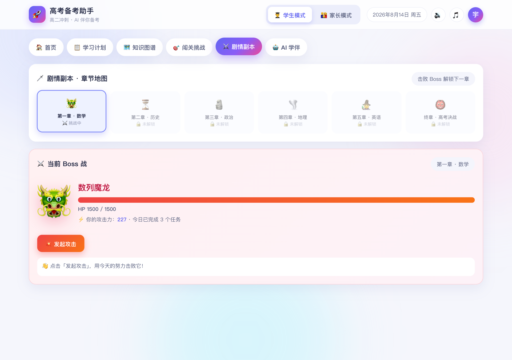
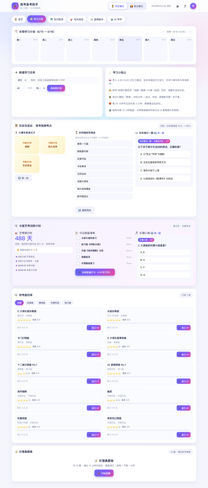
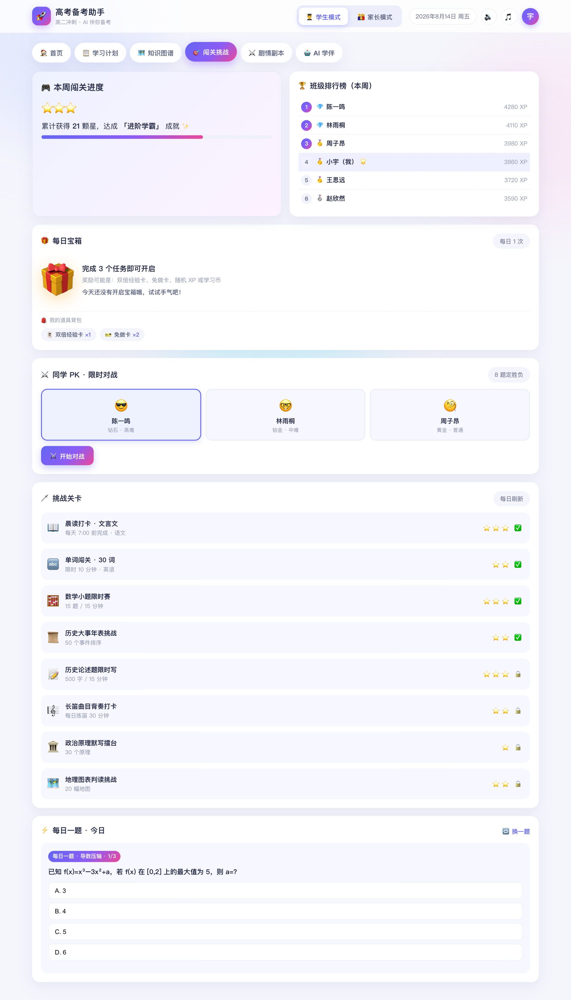
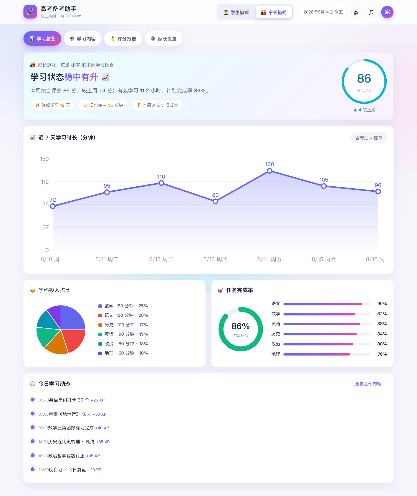
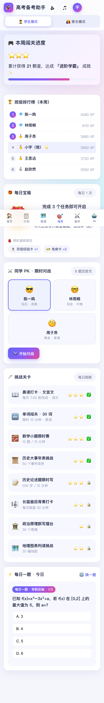

# 🚀 高考备考助手 · 高二文科冲刺｜AI 伴你备考

一个面向「高二升高三冲刺期」学生的**游戏化学习 + 家长陪伴**双端网站原型，
已配置为**文科组合（历史 + 政治 + 地理）**，孩子是**长笛音乐生**（内置柔和的长笛背景音乐），
支持**电脑 / 平板 / 手机三端自适应**。

> 本目录为**可交互原型**（纯 HTML/CSS/JS，无后端、无需安装、可离线运行）。
> **演示数据已全部清空**，当前为从零开始的状态，可直接正式使用（题库、知识图谱、副本等学习内容保留）。
> **两个独立页面**：
> - 学生端：`index.html`（李斯特专用，不含任何家长入口）
> - 家长端：`parent.html`（独立页面，含学习进度 / 内容 / 评分 / 设置）
> 换科目组合 / 改孩子姓名 / 改高考年份：直接编辑 `assets/app.js` 顶部的数据即可。

---

## 一、为什么这样设计（理念）

| 痛点 | 设计对策 |
|---|---|
| 学习枯燥、难以坚持 | 🎮 **游戏化**：段位、连击、徽章、副本 Boss、宝箱、PK、排行榜 |
| 学习容易分心 | 🍅 **番茄钟 + 专注森林**：25 分钟专注种下一棵树 |
| 缺少陪伴感 | 🐉 **学习宠物养成**：喂食、互动、换皮肤，陪他一起升级 |
| 孩子是音乐生、爱乐器 | 🎵 **长笛背景音乐**：纯代码合成的柔和长笛旋律，学习时自动陪伴 |
| 历史是弱项 | 📜 **历史攻坚站**：大事年表速记卡 + 时间轴排序游戏 + 历史每日一题 |
| 家长想了解进度却不打扰 | 👨‍👩‍👦 **家长专属端**：进度、内容、评分一目了然 |
| 学完不知道学得怎么样 | 📊 **五维评分体系**：把学习量化成看得懂的综合分 |

**核心原则**：评分、段位、排行榜是「激励」而不是「评判」，重在帮孩子建立持续的正反馈循环。

---

## 二、功能结构

### 🧑🎓 学生端（李斯特 · 文科组合 · 长笛音乐生）
1. **首页**：高考倒计时、连续打卡、段位进度（青铜→王者）、今日连击、经验值升级、
   今日任务、番茄钟、学习宠物「小火龙」（可喂食/互动/**换皮肤**）、专注森林、
   **个性称号墙**、**今日战报**、学科掌握度、徽章墙
2. **学习计划**：一周任务日历、新建任务、**📜 历史攻坚站**（大事年表速记卡、时间轴排序挑战、历史每日一题）、**🎼 长笛艺考训练计划**（艺考倒计时、今日练笛清单+打卡、乐理小测）
3. **知识图谱**：数学 / 历史 / 政治 / 地理，红黄绿掌握度着色
4. **闯关挑战**：每日关卡、班级排行榜、每日一题、每日宝箱 + 道具背包、**⚔️ 同学 PK 对战**
5. **剧情副本**：6 大章节 Boss（数列魔龙 → 高考大魔王），用学习成果攻击、掉落奖励、解锁下一章
6. **AI 学伴「小智」**：智能问答、错题归因、文科专属学习建议
7. **🎵 长笛背景音乐**：顶栏一键开启，柔和五声音阶长笛旋律，学累了可以吹给 TA 听
8. **🎼 艺考页**：长笛艺考训练计划、校考曲目库（含示范音频）、乐理真题卷/错题卷、艺考日历提醒、长笛五线谱、我的歌谱上传

### 👨‍👩‍👦 家长端
1. **学习总览**：综合评分、7 天时长趋势、学科投入占比、任务完成率、今日动态
2. **学习内容**：每日科目/内容/类型/时长/完成度/掌握度明细，可按科目筛选
3. **评分报告**：五维雷达、8 周趋势、AI 自动评语
4. **家长设置**：学习目标、通知提醒、亲子沟通建议

### 📱 三端自适应
- **电脑端（≥1025px）**：宽屏双栏 + 顶部页签
- **平板端（721–1024px）**：双栏/三栏自适应，周计划横向滑动
- **手机端（≤720px）**：单栏 + 底部导航栏（首页/计划/图谱/闯关/副本/AI）

---

## 三、学习评分体系

**综合评分（满分 100）= 完成度×30% + 正确率×25% + 坚持度×20% + 专注度×15% + 效率×10%**

| 维度 | 含义 | 权重 | 本周示例 |
|---|---|---|---|
| ✅ 任务完成度 | 计划任务完成比例 | 30% | 86 |
| 🎯 练习正确率 | 练习 / 小测正确率 | 25% | 82 |
| 🔥 学习坚持度 | 连续打卡与计划达成 | 20% | 90 |
| ⏱️ 专注度 | 有效专注时长 / 目标 | 15% | 78 |
| ⚡ 学习效率 | 单位时间掌握知识点数量 | 10% | 84 |

**评分输出**：每日 24:00 自动结算 → 每周家长周报（趋势 + 维度得分 + AI 评语）。

---

## 四、为男孩（音乐生）设计的创意玩法（全部已实现）

| 玩法 | 说明 |
|---|---|
| 🎵 **长笛背景音乐** | 顶栏 🎵 一键开关；Web Audio 合成、五声音阶、柔和可循环 |
| 🎼 **长笛艺考训练计划** | 艺考倒计时（省统考/校考时间轴）、今日练笛清单+打卡赚学习币、乐理小测题库 |
| 🎼 **校考曲目库** | 10 首经典长笛校考曲目（莫扎特/泰勒曼/中国作品等），按类别筛选、打卡练习、难度星级 |
| 📝 **乐理真题卷** | 10 题模拟统考卷（调式/音程/节奏/记号），交卷评分 + 错题回顾 |
| 👹 **错题魔王** | 答错的题会凝聚成 Boss，错题越多它越强；把错题做对才能击败它、错题清零 |
| 🎵 **曲目示范音频** | 每首曲目 ▶ 一键试听（Web Audio 合成，协奏/奏鸣/中国作品/练习曲不同风格） |
| 📝 **乐理错题卷** | 用你的乐理错题自动组卷，做对即消错题，全清有彩蛋 |
| 📅 **艺考日历** | 关键节点月历 + 下一个节点倒计时 + 日历提醒开关 |
| 🎼 **长笛五线谱** | 高音谱号音阶（C/G/F 大调），音符位置 + 指法，点击可发声 |
| 📤 **我的歌谱** | 上传歌谱图片，保存在本机浏览器，随时查看 |
| 📈 **难度/题量全面升级** | PK 题库 10→20 题、每局 5→8 题；每日一题升级为题库轮换；知识图谱每科 12 节点；时间轴 8 事件；速记卡 10 张；Boss 血量提升 |
| 🏅 **段位系统** | 青铜 → 白银 → 黄金 → 铂金 → 钻石 → 王者 |
| 🗡️ **剧情副本打 Boss** | 6 大章节 Boss，攻击力来自今日学习成果，掉落学习币/XP/称号 |
| 🏷️ **个性称号** | 12 个称号（早读战神、错题终结者、历史学究…）解锁佩戴 |
| 📜 **学习战报** | 每日战绩弹窗：任务/专注/连击/击杀/收益 + AI 评语 |
| ⚔️ **同学 PK** | 5 题限时对战，赢了得学习币 |
| 🔊 **音效彩蛋** | 完成/升级/Boss 命中/胜利/开箱音效（Web Audio 合成，可开关）|
| 🎨 **宠物换皮肤** | 火焰龙 → 机甲龙 → 雷电龙 → 冰霜龙，学习币购买 |
| 🐉 **学习宠物** | 喂食、陪玩、进化升级，学习有陪伴感 |
| 🌲 **专注森林** | 每完成一个番茄钟种一棵树 |
| ⚡ **今日连击** | 连续完成任务连击加成 |
| 📜 **历史攻坚站** | 速记卡 + 时间轴排序 + 历史每日一题，专攻历史弱项 |

### 💡 更多创意清单（后续可加）
- **错题 Boss**：把反复错的题做成「错题魔王」，专门攻克
- **班级锦标赛**：每周一次全班限时赛，段位与荣誉头衔
- **学习森林图鉴**：收集不同树种，建专属图鉴
- **离线时长积累**：番茄钟离屏也能累计，防作弊

---

## 五、技术说明

- 纯前端：`index.html` + `assets/style.css` + `assets/app.js`，零依赖、可离线运行
- 图表全部为原生 SVG；音效与长笛背景音乐为 **Web Audio API 代码合成**（无音频文件）
- 响应式：CSS 媒体查询三档断点（≤720 手机 / ≤1024 平板 / >1024 电脑）
- 数据集中在 `assets/app.js` 顶部，接入真实后端时只需替换数据层

### 文件清单
```
gaokao-prep-assistant/
├── index.html        # 学生端页面（不含家长入口）
├── parent.html       # 家长端独立页面
├── assets/
├── assets/
│   ├── style.css     # 设计系统、创意组件、响应式布局
│   └── app.js        # 数据、交互、图表、音效音乐、副本、PK、历史
├── preview/          # 三端效果预览图
└── README.md         # 本说明
```

## 六、效果预览

| 电脑端 · 学生首页 | 电脑端 · 剧情副本（Boss 战） |
|---|---|
|  |  |

| 电脑端 · 学习计划（含历史攻坚站） | 电脑端 · 闯关挑战（PK/宝箱） |
|---|---|
|  |  |

| 电脑端 · 家长总览 | 手机端 · 学生首页（底部导航） |
|---|---|
|  |  |

---

## 七、下一步建议（从原型到上线）

1. **接入真实数据**：学习任务、练习结果、专注时长来源（校内系统 / 学习 App 导出）
2. **账号体系**：孩子端与家长端分别登录，家长端受权限保护
3. **艺考模块**：音乐统考/校考时间轴、乐理题库、长笛练习计划与打卡
4. **多端触达**：微信小程序推送每日报告 / 周报，家长随时查看
5. **学习内容库**：对接教材知识点大纲，自动生成学习计划与每日一题

---

*原型演示版 · 数据均为示例｜为 2028 高考 · 高二文科·音乐生冲刺设计*
